# **ENROLIUM**

## **1. Summary**

**ENROLIUM** is a system we built to make section selection smoother and more user-friendly. We worked on both Frontend and Backend, focusing on giving everyone a fair chance during the selection process and making the system easy to use.
This trimester’s section selection process went way better than in previous terms. Last time, everyone had a tough time with section selection, and most couldn't get their preferred slots, which really frustrated them. From these difficulties, the idea for **ENROLLIUM** was born—a platform designed to simplify and enhance the section selection process for students.

## **2. System Overview**

### **2.1 Architecture Diagram**

The system consists of both a server and a client that communicate via a custom RPC. To establish a connection, users must provide their email and password. The entire system maintains a single source of truth, which is the database.

### **2.2 Technology Stack**

| Layer               | Technology                          | Purpose                                     |
|---------------------|-------------------------------------|---------------------------------------------|
| Language            | Java 23                             | Core application runtime                    |
| Build               | Gradle 8.10.2                       | Build automation and dependency management  |
| Frontend            | JavaFX 23, Atlantafx 2.0.1          | Modern user interface components            |
|                     | Ikonli 12.3.1                       | Icon library integration                    |
|                     | CSSFX 11.5.1                        | Dynamic CSS styling management              |
| UI Utilities        | DataFaker 2.4.2                     | Mock data generation for UI development     |
| Reactive Programming| RxJava 3.1.9                        | Asynchronous stream processing              |
| Communication       | Jackson JSON 2.18.2                 | RPC payload serialization/deserialization   |
| Database            | Hibernate ORM 6.6.3.Final           | Object-relational mapping                   |
|                     | PostgreSQL JDBC 42.7.4              | Database connectivity                       |
|                     | HikariCP 6.2.1                      | Connection pooling optimization             |
| Validation          | Jakarta Validation 3.1.0            | Data validation framework                   |
|                     | Hibernate Validator 8.0.1.Final     | Constraint enforcement implementation       |
| Security            | BCrypt 0.10.2                       | Password hashing and verification           |
| Logging             | Logback 1.4.11                      | Application logging framework               |
| Testing             | JUnit 5.10.3                        | Unit testing framework                      |
|                     | AssertJ 3.27.2                      | Fluent test assertions                      |
| System Monitoring   | OSHI 6.6.6                          | Hardware/OS metrics collection              |
| Utility             | Commons Text 1.12.0                 | String manipulation utilities               |
|                     | Lombok 1.18.36                      | Boilerplate code reduction                  |
|                     | JetBrains Annotations 26.0.1        | Static analysis hints                       |

## **3. Feature Documentation**

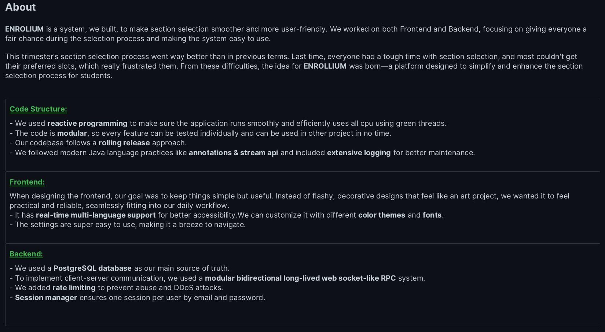

### **Database System**

**Implementation Status**: Complete

#### **What It Does**

- Single source of truth.
- Enforces ACID-compliant transactions for all critical operations.
- Supports complex relationships (e.g., prerequisites, trimester phases, section-teacher assignments).
- Generates demo data.

#### **Schema Design**

##### **Core Tables**
| Table                  | Description                                                                 | Relationships & Constraints                                                                                                                                                                                                 |
|------------------------|-----------------------------------------------------------------------------|-----------------------------------------------------------------------------------------------------------------------------------------------------------------------------------------------------------------------------|
| **`users`**            | Base user entity (login, name, password).                                   | - Inherited by `students`/`faculty` via `user_id` (joined-table). <br> - `email` (UNIQUE, NOT NULL).                                                                                                                        |
| **`students`**         | Student-specific data (e.g., university ID).                               | - `user_id` (PK, FK to `users.id`) <br> - `university_id` (UNIQUE, NOT NULL).                                                                                                                                               |
| **`faculty`**          | Faculty members (e.g., shortcode).                                         | - `user_id` (PK, FK to `users.id`) <br> - `shortcode` (UNIQUE, NOT NULL).                                                                                                                                                   |
| **`subjects`**         | Academic courses (e.g., credits, type).                                    | - `code_name` (UNIQUE, NOT NULL) <br> - `credits` (1–5) <br> - `type` (THEORY/LAB).                                                                                                                                         |
| **`trimesters`**       | Academic periods (e.g., status, dates).                                    | - `code` (UNIQUE, format `YY[1|2|3]`) <br> - `status` enforces phase logic (e.g., `COURSE_SELECTION` requires valid dates).                                                                                                 |
| **`sections`**         | Class sections (e.g., capacity, time slots).                               | - `trimester_id` (FK to `trimesters.id`) <br> - `subject_id` (FK to `subjects.id`) <br> - `max_capacity` (≥1) <br> - `space_time_slots` (NOT EMPTY).                                                                        |
| **`courses`**          | Student enrollments (e.g., status, grade).                                 | - Unique constraint: `(student_id, subject_id, trimester_id, section_id)` <br> - `grade` (0.0–4.0) <br> - `status` validates `section`/`grade` compatibility.                                                              |
| **`prerequisites`**    | Subject dependencies (e.g., "CSE3521 requires CSE1116").                   | - `subject_id` (FK to `subjects.id`) <br> - `prerequisite_id` (FK to `subjects.id`) <br> - No cycles (code-enforced).                                                                                                       |
| **`space_time`**       | Physical/time slots for sections.                                          | - Unique constraint: `(room_number, day_of_week, timeslot)` <br> - `time_slot` validated by `room_type`.                                                                                                                   |
| **`notifications`**    | System announcements (e.g., scope, category).                              | - `scope` determines `trimester`/`section`/`target_user` validity (e.g., `SECTION` requires non-null `section_id`).                                                                                                        |

##### **Join Tables**
| Table                  | Purpose                                      | Structure                                                                                   |
|------------------------|----------------------------------------------|---------------------------------------------------------------------------------------------|
| **`faculty_subjects`** | Faculty’s teachable subjects.               | `faculty_id` (FK to `faculty.user_id`), `subject_id` (FK to `subjects.id`).                 |
| **`section_space_times`** | Assigns time slots to sections.         | `section_id` (FK to `sections.id`), `space_time_id` (FK to `space_time.id`).                |
| **`section_faculty`**  | Assigns teachers to sections.               | `section_id` (FK to `sections.id`), `faculty_id` (FK to `faculty.user_id`).                 |

The `DB` class provides reactive CRUD operations via Hibernate and RxJava. Below are common use cases:

#### **1. Saving an Entity**

```java
// Create a new student
Student student = new Student();
student.setName("John Doe");
student.setEmail("john@uiu.ac.bd");
student.setPassword("securePass123");
student.setUniversityId(112233445);

// Persist to DB
DB.save(student)
  .subscribe(
      savedStudent -> System.out.println("Saved: " + savedStudent.getId()),
      error -> System.err.println("Error: " + error.getMessage())
  );
```

#### **2. Querying Entities**

```java
// Fetch first 10 courses, sorted by creation date
DB.read(Student.class, limit, offset)
    .timeout(20, TimeUnit.SECONDS)
    .collect(ArrayList::new, (list, item) -> list.add(item))
    .onErrorResumeNext(error -> new RuntimeException("Failed to fetch student list: " + error.getMessage()));
```

#### **3. Updating an Entity**

```java
// Update a student's email
DB.findById(Student.class, UUID.fromString(id))
 .toSingle()
 .flatMap(student -> {
     student.setName(name);
     return DB.update(student);
 })
 .onErrorResumeNext(error -> new RuntimeException("Failed to update student: " + error.getMessage()));
```

#### **4. Deleting an Entity**

```java
// Delete a notification by ID
DB.delete(Student.class, UUID.fromString(id))
  .subscribe(
      () -> System.out.println("Deleted successfully"),
      error -> System.err.println("Deletion failed: " + error.getMessage())
  );
```

#### **5. Complex Queries**

```java
// Count registered courses for a student
DB.count(Course.class)
  .map(total -> "Total courses: " + total)
  .subscribe(System.out::println);

// Check if a section is full
DB.findById(Section.class, sectionId)
  .map(section -> section.getCurrentCapacity() >= section.getMaxCapacity())
  .subscribe(isFull -> System.out.println("Section full? " + isFull));
```

#### **6. Resetting the Database**

```java
// Wipe and re-seed with demo data
DB.resetAndSeed()
  .subscribe(
      () -> System.out.println("Database reset complete"),
      error -> System.err.println("Reset failed: " + error.getMessage())
  );
```

#### **7. Transactional Operations**

For custom transactions (e.g., batch updates):
```java
DB.exec(session -> {
    // Manual Hibernate operations
    session.createMutationQuery("UPDATE Course SET grade = 4.0 WHERE status = 'COMPLETED'").executeUpdate();
    return null;
}, "Batch Grade Update").subscribe();
```

#### **Future Improvements**

- Cache frequently accessed entities like `subjects` and `trimesters`.
- Implement database-level triggers for cross-table validations (e.g., section capacity checks).

### **Bidirectional RPC System**

**Implementation Status**: Complete

#### **What It Does**

- Enables real-time client-server communication with session-aware routing
- Handles 150+ concurrent requests with automatic retries and timeouts
- Provides atomic message delivery with JSON serialization
- Supports server-initiated notifications (e.g., schedule changes)

#### **How It Works**


1. **Protocol**:
   - Message framing: 4-byte length header + JSON payload
   - Type hierarchy: `Message` → `Request`/`Response`
   - Session binding via `sessionToken` field

3. **Sequence**:
   1. Client establishes TCP connection
   2. Authentication handshake via `auth` method
   3. Subsequent requests use session token
   4. Server pushes notifications via same channel


**Code Snippet**:
```java
// Client-side
ObjectNode authParams  = JsonUtils.createObject().put("email", email).put("password", password);
Request    authRequest = Request.create(messageIdCounter.getAndIncrement(), "auth", authParams, null);
Response authResponse = ClientRPC.getInstance().sendRequest(authRequest).timeout(5, TimeUnit.SECONDS).blockingGet();
```
```java
// Server handler registration
server.registerMethod("auth", (params, request) -> {
    try {
        // Validate request parameters
        if (params == null) return Single.error(new IllegalArgumentException("Missing auth parameters"));

        String email    = JsonUtils.getString(params, "email");
        String password = JsonUtils.getString(params, "password");

        if (!(email != null && password != null && !email.trim().isEmpty() && !password.trim().isEmpty()))
            return Single.error(new IllegalArgumentException("Invalid credentials"));

        int size = Math.toIntExact(DB.count(User.class).blockingGet());

        return DB.read(User.class, size, 0)
                 .filter(user -> email.equals(user.getEmail()))
                 .firstElement()
                 .toSingle()
                 .flatMap(user -> {
                     if (!user.verifyPassword(password)) {
                         return Single.error(new IllegalArgumentException("Invalid password"));
                     }

                     // Create session
                     String UUID = user.getId().toString();
                     SessionInfo session = SessionManager.getInstance().createSession(UUID, request.getConnection().getSocket(), server);

                     // Return success response
                     JsonNode response = JsonUtils.createObject()
                                                  .put("sessionToken", session.getSessionToken())
                                                  .put("uuid", UUID)
                                                  .put("userType", user.getType().toString());

                     return Single.just(response);
                 })
                 .onErrorResumeNext(error -> {
                     if (error instanceof NoSuchElementException) return Single.error(new IllegalArgumentException("User not found"));
                     return Single.error(error);
                 });
    } catch (Exception e) {
        return Single.error(e);
    }
});
```

**Message Structure**:
- Request
```json
{
    "id": 1,
    "timestamp": 1738415230282,
    "version": "r145.63cc2b3",
    "type": "req",
    "method": "auth",
    "params": {
        "email": "demo.student@uiu.ac.bd",
        "password": "WrongPass"
    },
    "sessionToken": null,
    "connection": null
}
```
- Success Response
```json
{
    "id": 1,
    "timestamp": 1738415232717,
    "version": "r145.63cc2b3",
    "type": "res",
    "method": "success",
    "params": {
        "sessionToken": "9361147112443298276352683881617408806308841024330508058726967887",
        "uuid": "af0f9edf-73c3-47cc-85c7-851e1ea99f36",
        "userType": "STUDENT"
    },
    "error": false,
    "errorMessage": null
}
```
- Error Response
```json
{
    "id": 1,
    "timestamp": 1738415230525,
    "version": "r145.63cc2b3",
    "type": "res",
    "method": "error",
    "params": {
        "message": "Invalid password"
    },
    "error": true,
    "errorMessage": "Invalid password"
}
```
- Heartbeat
```json
{
    "id": 8,
    "timestamp": 1738415442684,
    "version": "r145.63cc2b3",
    "type": "req",
    "method": "health",
    "params": null,
    "sessionToken": "9361147112443298276352683881617408806308841024330508058726967887",
    "connection": null
}
```
```json
{
    "id": 8,
    "timestamp": 1738415442686,
    "version": "r145.63cc2b3",
    "type": "res",
    "method": "success",
    "params": {
        "serverVersion": "r145.63cc2b3",
        "status": "ok",
        "serverTime": 1738415442686
    },
    "error": false,
    "errorMessage": null
}
```

**Connection Lifecycle**:
1. Client connects via `ClientRPC.start()`
2. Auth exchange using credentials
3. Server creates `SessionInfo` with 24h TTL
4. Heartbeats reset TTL on each message
5. Cleanup thread removes expired sessions

#### **Future Improvements**

- Add encryption in `RPCConnection`
- Session token rotation
- Protobuf for serialization
- Message compression for large payloads
- Idempotency keys for retries

### **Session Management**

**Implementation Status**: Complete

#### **What It Does**
- Maintains authenticated user sessions with time-to-live (TTL) tracking
- Binds network connections to user identities for stateful communication
- Automatically cleans up expired/inactive sessions to free resources

#### **How It Works**
1. **Session Creation**:
    - Generates unique 64-character token via `SecureRandom` on successful authentication
    - Stores session metadata (user ID, connection, timestamps) in `ConcurrentHashMap`
2. **Validation**:
    - Checks `isActive()` flag and `expirationTime` on every authenticated request
    - Updates `lastHeartbeat` timestamp on valid operations
3. **Cleanup**:
    - Scheduled thread scans sessions every 1 minute
    - Removes sessions exceeding 24-hour TTL or 30-second heartbeat timeout

#### **Session Storage**
```json
{
    "9361147112443298276352683881617408806308841024330508058726967887" : {
        "sessionToken" : "9361147112443298276352683881617408806308841024330508058726967887",
        "userId" : "af0f9edf-73c3-47cc-85c7-851e1ea99f36",
        "tags" : [ ],
        "createdAt" : 1738415232717,
        "lastHeartbeat" : 1738415262686,
        "expirationTime" : 1738501662686,
        "active" : true,
        "expired" : false,
        "ip" : "127.0.0.1"
    }
}
```

### **Rate Limiting**

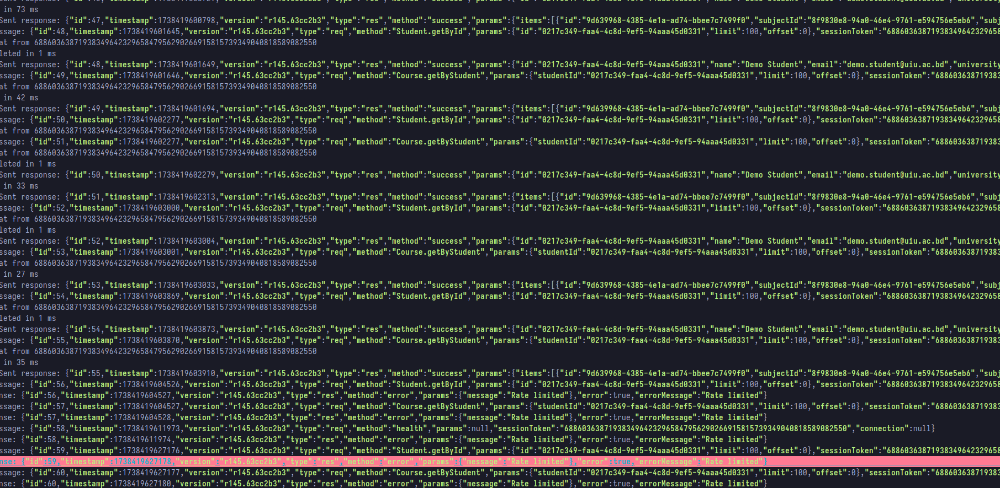

#### **What It Does**
- Enforces request quotas to prevent system overload
- Applies different limits for unauthenticated (IP-based) and authenticated (session-based) traffic
- Protects against DDoS and brute-force attacks

#### **How It Works**
1. **Counting Mechanism**:
    - Uses `ConcurrentHashMap` to track request counts per IP/session
    - Merges counts atomically using `Integer::sum`
2. **Limit Enforcement**:
    - Denies requests exceeding 32/minute for IPs (pre-auth)
    - Allows 512/minute for authenticated sessions
3. **Periodic Reset**:
    - Scheduled task clears all counters every 60 seconds

#### **Storage**:
```json
{
        "9361147112443298276352683881617408806308841024330508058726967887" : 1,
        "127.0.0.1" : 4
}
```

### **System Logging Infrastructure**

**Implementation Status**: Complete

#### **What It Does**
- Captures critical system metadata during startup
- Logs Java properties, environment variables, and hardware specs
- Provides runtime diagnostics for troubleshooting

#### **How It Works**

1. **Entry Point**:
   - `Issue.print(logger)` called during application bootstrap

2. **Data Collection**:
   - System Properties via `System.getProperties()`
   - Environment Variables via `System.getenv()`
   - Hardware Metrics using `OperatingSystemMXBean`

3. **Formatting**:
   - Section headers with indented key-value pairs
   - Memory values auto-converted to GB

**Example Output**:
```txt
JAVA SYSTEM PROPERTIES:
    file.encoding: UTF-8
    java.class.version: 67.0
    java.home: /usr/lib/jvm/java-23-openjdk
    ...

ENVIRONMENT VARIABLES:
    BROWSER: firefox
    EDITOR: micro
    LANG: en_US.UTF-8
    LANGUAGE: en_US:en:C
    LC_ADDRESS: C.utf8
    LC_COLLATE: C.utf8
    LC_CTYPE: en_US.UTF-8
    LC_IDENTIFICATION:
    LC_MEASUREMENT: C.utf8
    LC_MESSAGES: en_US.UTF-8
    LC_MONETARY: en_US.UTF-8
    LC_NAME: en_US.UTF-8
    LC_NUMERIC: en_US.UTF-8
    LC_PAPER: en_US.UTF-8
    LC_TELEPHONE: C.utf8
    LC_TIME: C.utf8
    ...

HARDWARE INFORMATION:
    OS Name: Linux
    OS Version: 6.12.10-zen1-1-zen
    OS Architecture: amd64
    Available Processors (Cores): 8
    Total Physical Memory: 23 GB
    Free Physical Memory: 8 GB
    Total Swap Space: 11 GB
    Free Swap Space: 6 GB
```

#### **Why It Exists**
- Essential for debugging environment-specific issues
- Provides visibility into resource constraints

#### **Future Improvements**
- Add disk space monitoring
- Periodic runtime snapshots
- Integration with monitoring systems like Prometheus

### **Semantic Version Generation**

**Implementation Status**: Complete

#### **What It Does**
- Generates version strings from Git history
- Formats as `r<commit_count>.<short_hash>` (e.g., `r145.63cc2b3`)
- Automatically generates new one at build

#### **Implementation**

```java
String v = Version.getVersion();
```

#### **Workflow**
1. Build process executes `generateVersion()` Gradle task
2. Writes version to `src/main/resources/version.properties`
3. Application loads via static initializer

#### **Why It Exists**
- Eliminates manual version tracking
- Links deployments to exact code states

#### **Future Improvements**
- Nightly build automation
- Version metadata endpoint in RPC system

### **Internationalization**

**Implementation Status**: Partial (90%)

**Demo**:

#### **What It Does**
- Can support more languages by editing an enum
- Centralized translation management
- Hot-reload language without restart

#### **Architecture**
1. **Resource Bundles**:
   - `messages_en.properties`: English translations
   - `messages_bn.properties`: Bengali translations

2. **Validation**:
   - Startup check for missing keys in all bundles

3. **Reactive Updates**:
   - `SettingsManager` notifies `I18nManager` of language changes

**Usage**:
```java
String greeting = I18nManager.instance.get(TranslationKey.HELLO);
```

#### **Future Improvements**
- Add right-to-left (RTL) layout support
- Dynamic bundle reloading from filesystem
- Pluralization rules implementation

### **Global State Management**

**Implementation Status**: Complete

#### **What It Does**
- Thread-safe shared memory for cross-component data
- Stores session tokens, UI states, and temporary workflows

#### **Implementation**
```java
// Store current user
Volatile.getInstance().put("currentUser", user);
```
```java
// Retrieve chat history
List<Message> chat = (List<Message>) Volatile.getInstance().get("activeChat");
```

**Key Features**:
- ConcurrentHashMap backend for scalability
- Audit logging on write/delete operations
- Singleton access via double-checked locking

#### **Future Improvements**
- TTL-based auto-expiry for entries
- Size monitoring and eviction policies
- Cluster-aware replication for distributed mode

### **Persistent User Settings**

**Implementation Status**: Complete

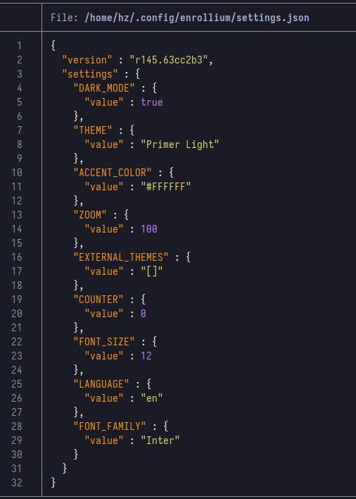

#### **What It Does**
- Maintains all user preferences across sessions
- OS-appropriate config file storage
- Type-safe validation with reactive updates

#### **Data Flow**

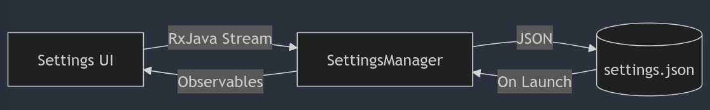

**Key Features**:
- Cross-platform config paths:
    - Windows: `%APPDATA%\enrollium\settings.json`
    - Linux: `~/.config/enrollium/settings.json`
    - macOS: `~/Library/Application Support/enrollium/settings.json`
- Versioned schema migrations
- Debounced autosave (1-second delay)

#### **Why It Exists**
- Essential for personalized user experience
- Reduces setup friction across devices

#### **Future Improvements**
- Cloud sync via RPC system
- Settings import/export UI
- Historical version rollback

### **Chat System**

**Implementation Status**: Complete

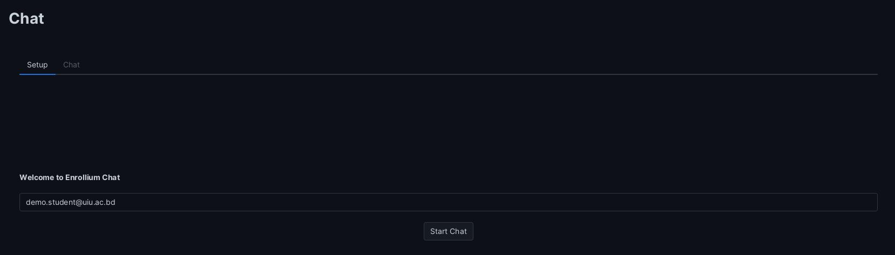
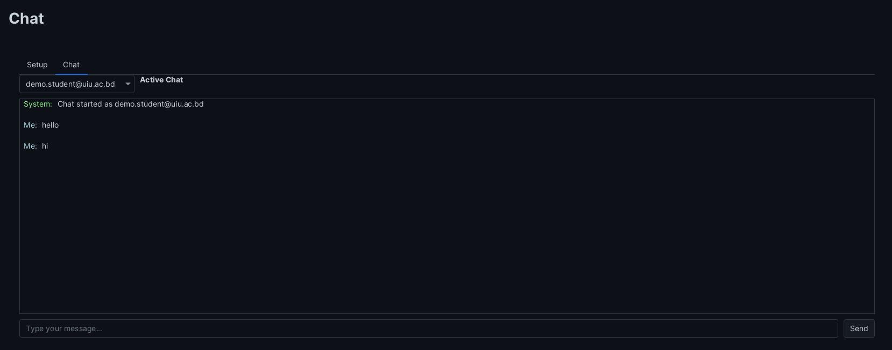

#### **What It Does**

- **Core Functionality**: Enables real-time chat between users with persistent message history.
- **User Impact**: Provides a seamless communication experience with intuitive UI, message history, and system notifications.

### **Offered Course Page**

**Implementation Status**: Complete

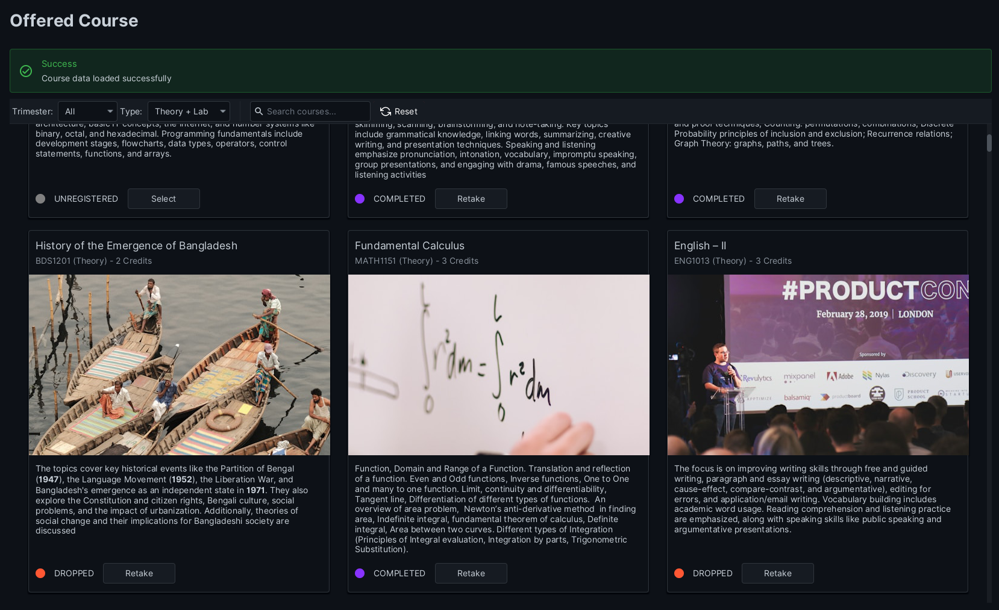

#### **What It Does**

- Displays a list of offered courses with filtering options (Trimester, Course Type, Search).
- Allows students to **select, register, withdraw, or retake** courses dynamically.
- Provides **real-time status updates** on course selection.

#### **Why It Exists**

- **Business Need**: Enhances the course enrollment process for students.
- **Technical Rationale**: Reduces server load by implementing efficient RPC calls and caching.

#### **Future Improvements**

- **Performance**: Optimize filtering logic using indexed lookups.
- **Functionality**: Implement bulk course selection.
- **UX**: Improve accessibility by adding keyboard navigation support.

### **Section Selection & Registration Status**

**Implementation Status**: Partial

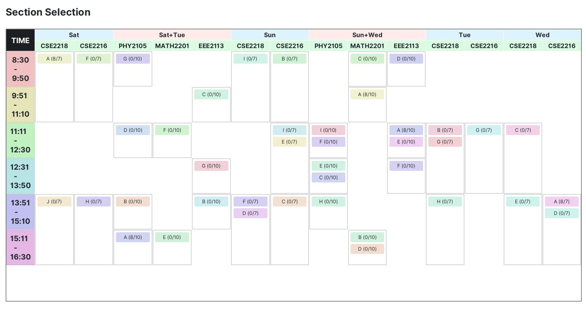

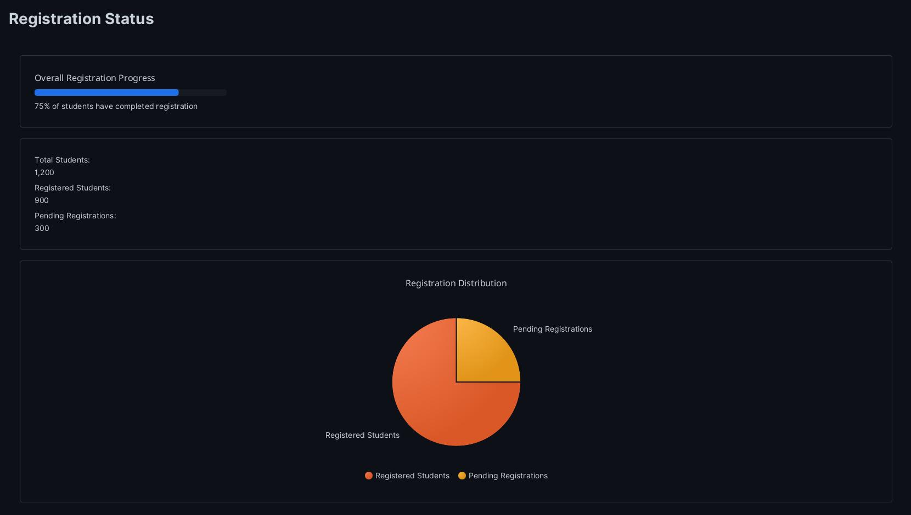

#### **What It Does**
- Enables users to manage course sections, including subject, trimester, and capacity.
- Provides real-time registration status with progress tracking and statistics.

#### **Future Improvements**
- **Performance**: Optimize table refresh logic for large datasets.
- **Functionality**: Allow bulk section creation and edits.
- **UX**: Improve notification system and introduce filtering options for section searches.

### **Trade Feature**

**Implementation Status**: Partial

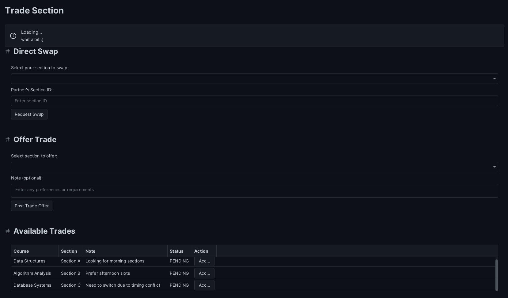

#### **What It Does**

- Enables students to **swap course sections** or **offer trades** with others.
- Provides an **interactive UI** for selecting sections, proposing trades, and accepting offers.
- Uses a **real-time update mechanism** to ensure trade availability stays current.

#### **Why It Exists**

- **Business Need**: Allows students to **self-manage section changes**, reducing admin workload.
- **Technical Rationale**: Replaces a **manual trade request system**, improving efficiency.

#### **Future Improvements**

- **Performance**: Cache frequently accessed trade data to reduce API calls.
- **Functionality**: Add **bulk trade requests** to facilitate multiple swaps at once.
- **UX**: Provide **visual indicators** for pending, accepted, or rejected trades.

### **Server Status Monitoring**

**Implementation Status**: Complete

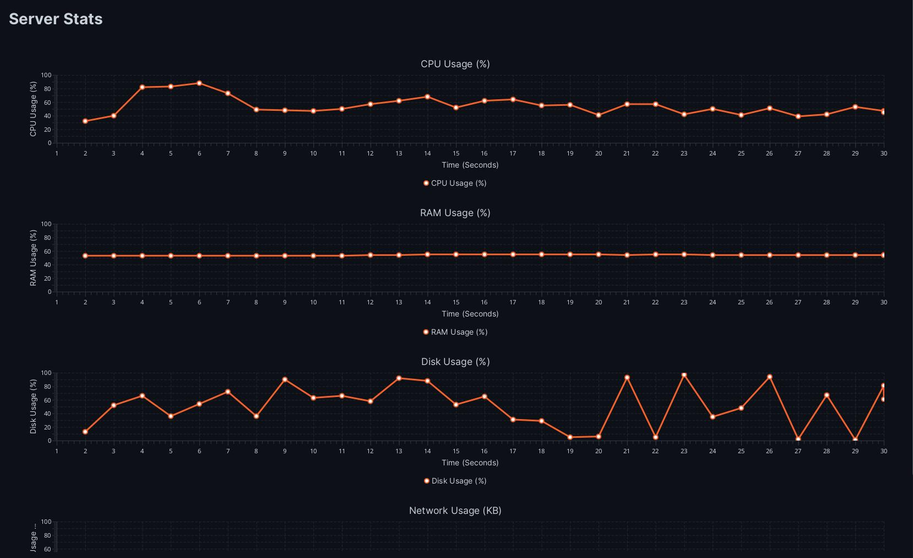

#### **What It Does**

- Provides real-time monitoring of server performance metrics.
- Displays CPU, RAM, Disk, and Network usage via line charts.
- Fetches and updates server statistics dynamically every second.

**Patterns/Concepts**:
- Observer pattern for UI updates.
- Timeline-based periodic data fetching.
- Asynchronous RPC calls for server communication.

#### **Why It Exists**

- **Business Need**: Ensures real-time monitoring for system administrators to track performance and prevent downtimes.
- **Technical Rationale**: Replaces manual log-based tracking with a dynamic, interactive dashboard.

#### **Future Improvements**

- **Performance**: Optimize data handling to prevent UI lag when updating charts.
- **Functionality**: Add historical data visualization beyond the last 30 seconds.
- **UX**: Implement tooltips and additional analytics for deeper insights into server performance trends.

### **Notification**

**Implementation Status**: Partial

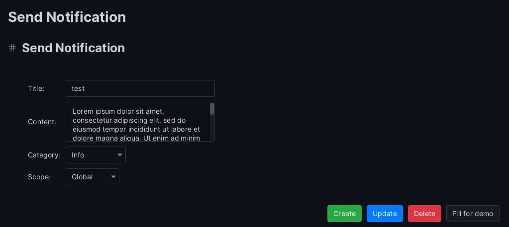

#### **What It Does**

- Enables sending notifications with customizable title, content, category, and scope.
- Provides options to create, update, and delete notifications.
- Supports quick demo content filling for testing purposes.

**Patterns/Concepts**:
- Observer pattern for UI updates.
- Form-based input validation.
- Modular UI components for reusability.

#### **Why It Exists**

- **Business Need**: Facilitates real-time communication with users.
- **Technical Rationale**: Provides a structured and user-friendly notification system, replacing ad-hoc message handling.

#### **Future Improvements**

- **Performance**: Optimize UI responsiveness for large-scale notification batches.
- **Functionality**: Add scheduling support for delayed notifications.
- **UX**: Implement rich-text support for better message formatting.

### **Course Withdrawal**

**Implementation Status**: Partial

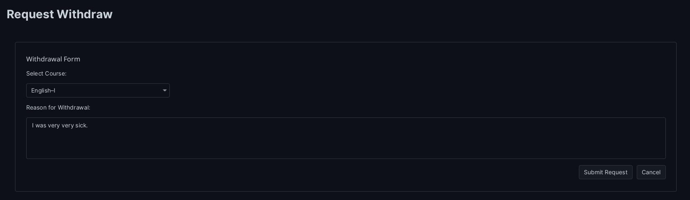
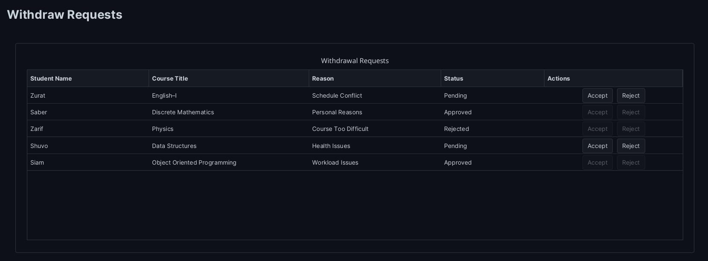

#### **What It Does**

- Provides an interface for students to submit withdrawal requests.
- Allows administrators to review, approve, or reject requests.
- Displays real-time updates on the request status.

#### **Patterns/Concepts**

- **Observer Pattern**: Used for updating the UI dynamically when a request is processed.
- **MVC Architecture**: Separates request handling logic from UI components.
- **State Management**: Requests can exist in different states: *Pending, Approved, Rejected*.

#### **Why It Exists**

- **Business Need**: Ensures a structured process for students to withdraw from courses.
- **Technical Rationale**: Replaces manual processing with a digital workflow to improve efficiency.

#### **Future Improvements**

- **Performance**: Optimize UI rendering with lazy loading for large datasets.
- **Functionality**: Implement batch processing for multiple requests at once.
- **UX**: Add filtering and sorting options for withdrawal requests.

### **Comprehensive Database Management**

**Implementation Status**: Partial

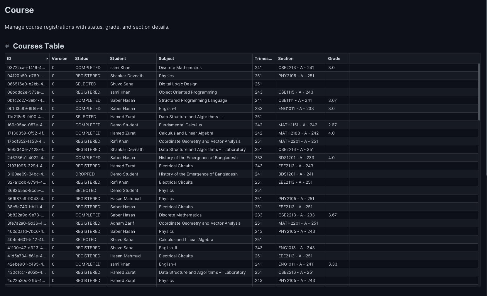
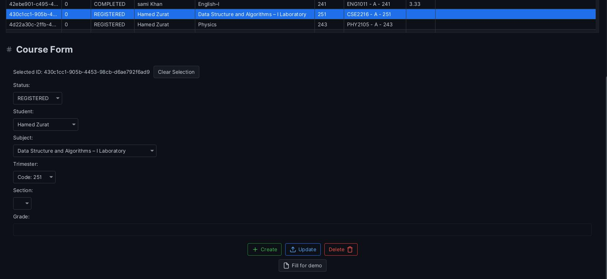

**Key Features**
- CRUD for all infos in db.
- Keeps everything organized and easy to access and modify.

**Future Improvements**
- Add more filters for better search options.
- Sync changes across the platform instantly.
- Provide insights into enrollment trends.

### **History**

**Implementation Status**: Complete

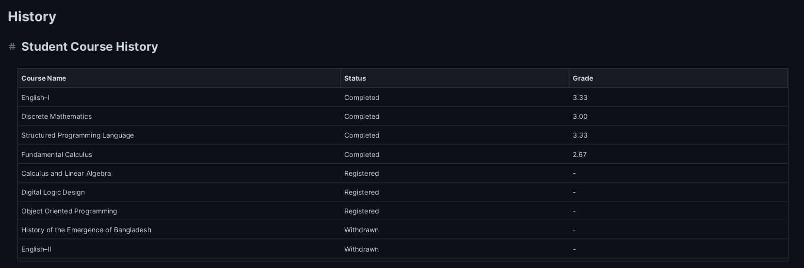

- This shows a students all the course list.

**Future Improvements**
- Better UI.
- Better statistics.
- Better actions.

### **Search**

**Implementation Status**: Complete

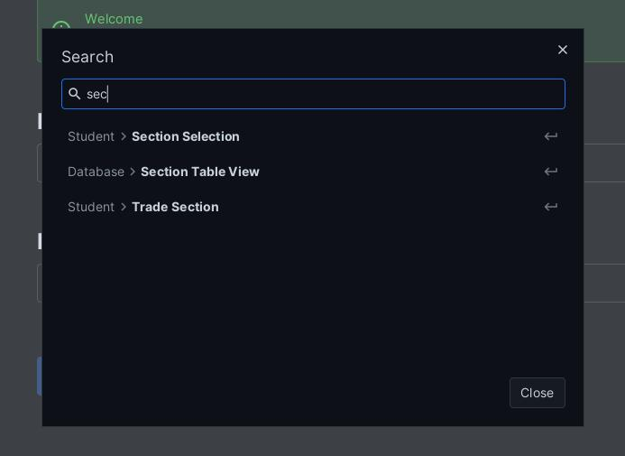

- You can easily find the page you want.
- You can press the `/` button to open the search dialogue.

### **Login, User Info, and Forgot Password**

**Implementation Status**: Complete

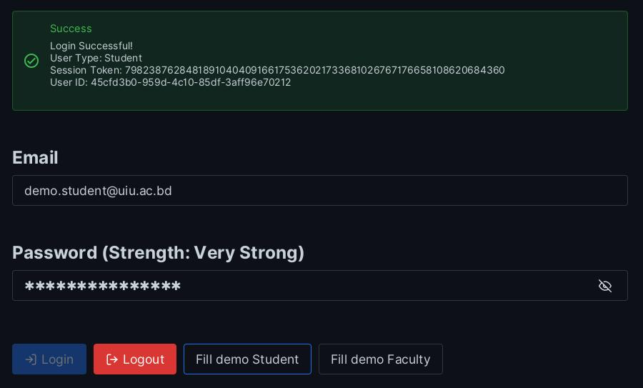
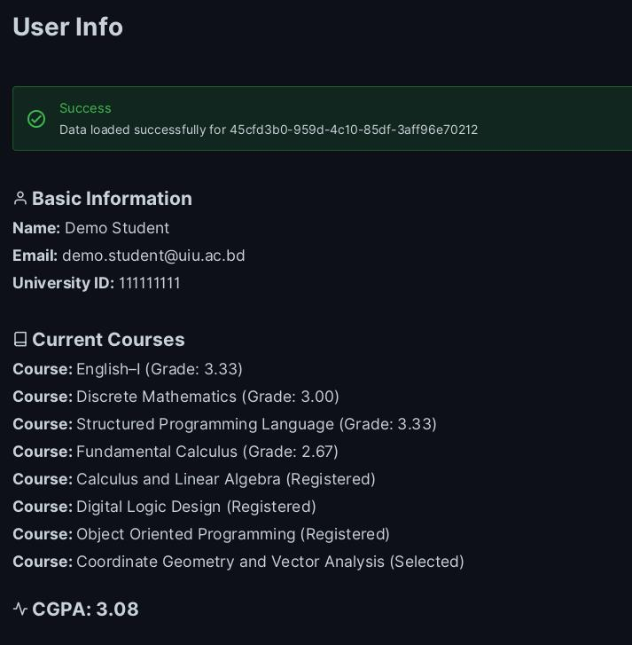
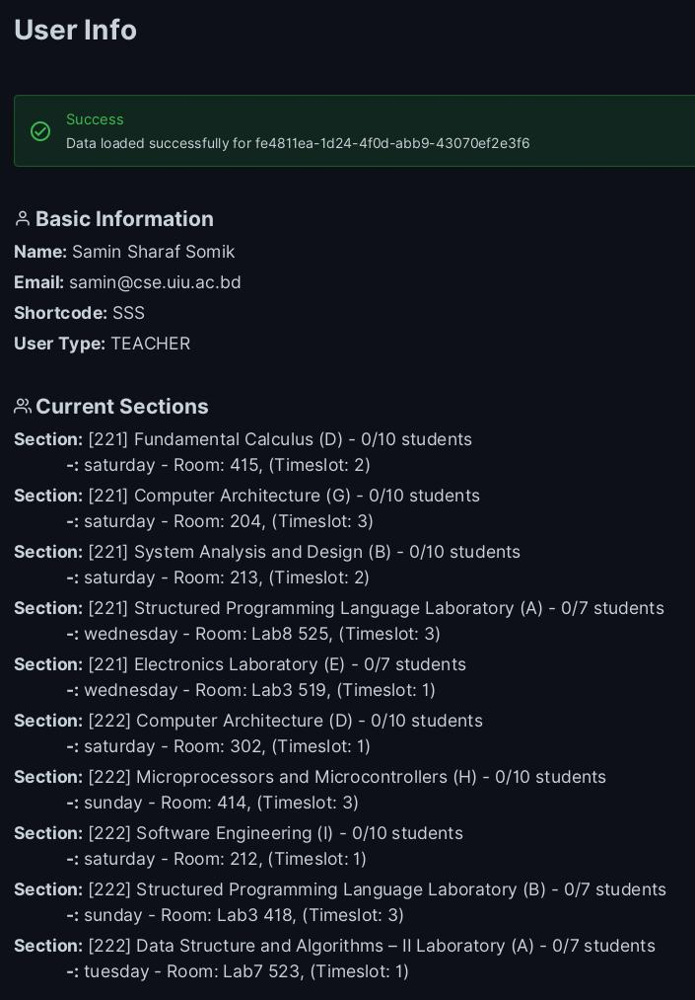

**Key Features**
- Secure login with passwords.
- Reset forgotten passwords via email.

**Future Improvements**
- Use magic links or one-time codes instead of passwords.
- Notify users of suspicious activity on their account.
- Let users log in once to access multiple platforms.

### **Theme Change**

**Implementation Status**: Complete

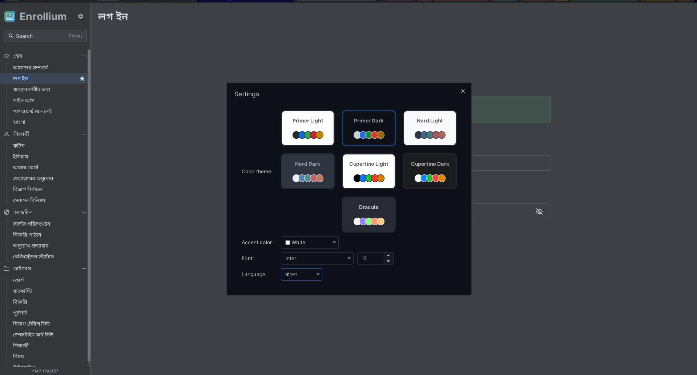
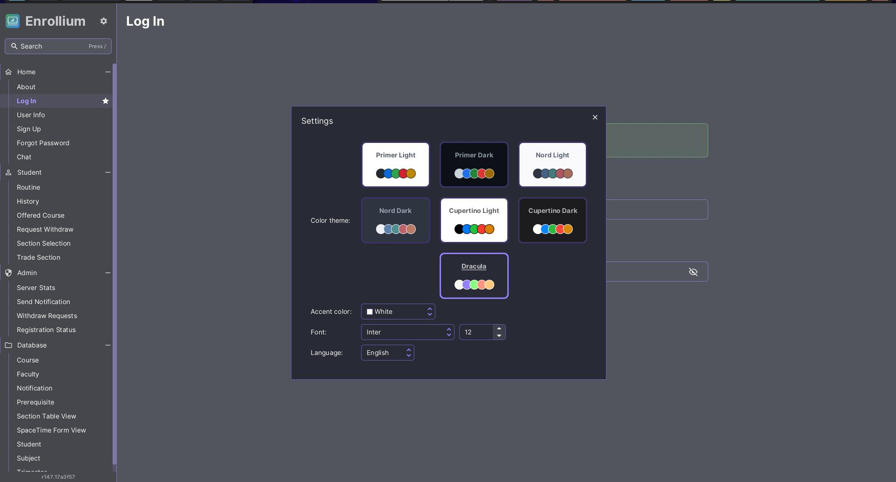
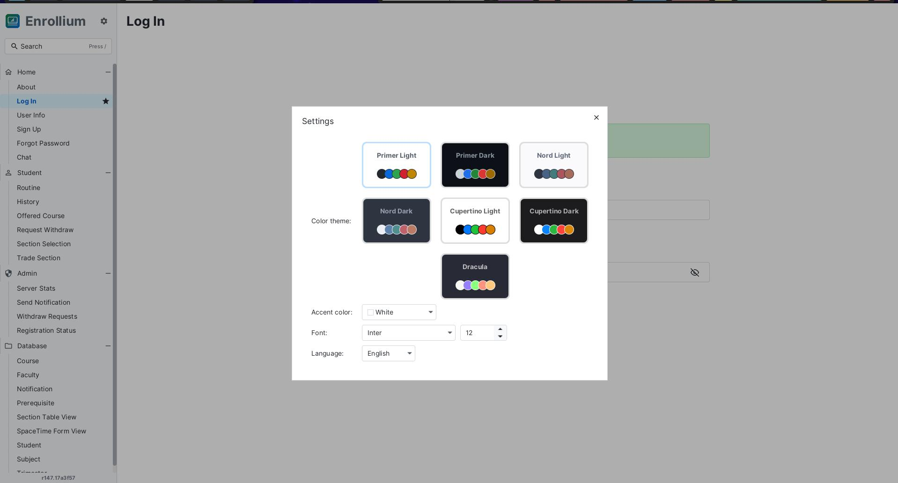

**Key Features**
- Switch between light and dark mode.
- Choose from pre-designed themes or create your own.

**Future Improvements**
- Adjust themes based on lighting or user preferences.
- Let users customize fonts, spacing, and colors.
- Add fun themes for holidays or special events.
