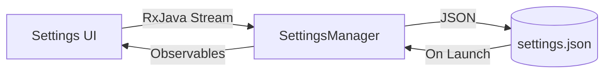

# **ENROLIUM**

## **1. Summary**

ENROLIUM was born out of the frustration students faced during chaotic course enrollment periods, where outdated systems often left learners scrambling for sections or stuck with incompatible schedules.
This project reimagines enrollment as a collaborative, transparent process rather than a zero-sum race. At its core, ENROLIUM ensures fairness through randomized lotteries during high-demand registration windows while empowering students with tools like *real-time trade matching*—a graph-based system that lets users swap sections like puzzle pieces until everyone’s schedule clicks into place.
Beyond individual needs, it acknowledges the reality of group learning: students can team up to coordinate schedules, though the system deliberately limits group advantages to prevent monopolization.
The clean JavaFX interface hides sophisticated backend mechanics—atomic seat reservations, session-aware RPC calls, and ACID-compliant transactions—behind a deliberately minimalist design, prioritizing reliability over flashy visuals.

## **2. System Overview**

### **2.1 Architecture Diagram**


*(Annotate components: UI, RPC, DB, etc.)*

### **2.2 Technology Stack**

| Layer         | Technology    | Purpose                          |
|---------------|---------------|----------------------------------|
| Frontend      | JavaFX 17     | User interface rendering         |
| Communication | gRPC/gSocket  | Bidirectional RPC implementation |
| Database      | PostgreSQL 15 | Data persistence                 |

## **3. Feature Documentation**

*Repeat for each feature including the database and RPC system*

### **3.X [Feature Name]**

**Implementation Status**:
✅ Complete / 🟡 Partial (70%) / ❌ Prototype

**Demo**:

*(Or: [Video Link] with timestamps for key actions)*

#### **What It Does**

- Core functionality (e.g., "Real-time inventory updates")
- User-facing impact (e.g., "Reduces checkout time by 40%")

#### **How It Works**

```markdown
1. **Workflow**:
    - Step 1: User triggers [Action] in `MainUI.java`
    - Step 2: RPC call via `RpcService.sendRequest()`
    - Step 3: Database transaction in `InventoryDAO.updateStock()`

2. **Key Classes**:
    - `FeatureController.java`: Handles UI logic
    - `DataProcessor.java`: Business logic

3. **Patterns/Concepts**:
    - Observer pattern for UI updates
    - Connection pooling for DB access
```

#### **Why It Exists**

- Business need: "Required for compliance with [Regulation X]"
- Technical rationale: "Replaces legacy system bottleneck"

#### **Future Improvements**

- **Performance**: "Replace ArrayList with HashMap for O(1) lookups"
- **Functionality**: "Add bulk edit support (partially implemented in `BulkEditBranch`)"
- **UX**: "Tooltips for form fields shown in [Fig 3.X]"

### **3.1 Database System**

**Implementation Status**: ✅ Complete

**Demo**:

*(Key tables: `users`, `courses`, `subjects`, `sections`, `trimesters`, `notifications`)*

#### **What It Does**

- Single source of truth.
- Enforces ACID-compliant transactions for all critical operations.
- Supports complex relationships (e.g., prerequisites, trimester phases, section-teacher assignments).
- Generates demo data.

#### **Schema Design**

##### **Core Tables**
| Table                  | Description                                                                 | Relationships & Constraints                                                                                                                                                                                                 |
|------------------------|-----------------------------------------------------------------------------|-----------------------------------------------------------------------------------------------------------------------------------------------------------------------------------------------------------------------------|
| **`users`**            | Base user entity (login, name, password).                                   | - Inherited by `students`/`faculty` via `user_id` (joined-table). <br> - `email` (UNIQUE, NOT NULL).                                                                                                                        |
| **`students`**         | Student-specific data (e.g., university ID).                               | - `user_id` (PK, FK to `users.id`) <br> - `university_id` (UNIQUE, NOT NULL).                                                                                                                                               |
| **`faculty`**          | Faculty members (e.g., shortcode).                                         | - `user_id` (PK, FK to `users.id`) <br> - `shortcode` (UNIQUE, NOT NULL).                                                                                                                                                   |
| **`subjects`**         | Academic courses (e.g., credits, type).                                    | - `code_name` (UNIQUE, NOT NULL) <br> - `credits` (1–5) <br> - `type` (THEORY/LAB).                                                                                                                                         |
| **`trimesters`**       | Academic periods (e.g., status, dates).                                    | - `code` (UNIQUE, format `YY[1|2|3]`) <br> - `status` enforces phase logic (e.g., `COURSE_SELECTION` requires valid dates).                                                                                                 |
| **`sections`**         | Class sections (e.g., capacity, time slots).                               | - `trimester_id` (FK to `trimesters.id`) <br> - `subject_id` (FK to `subjects.id`) <br> - `max_capacity` (≥1) <br> - `space_time_slots` (NOT EMPTY).                                                                        |
| **`courses`**          | Student enrollments (e.g., status, grade).                                 | - Unique constraint: `(student_id, subject_id, trimester_id, section_id)` <br> - `grade` (0.0–4.0) <br> - `status` validates `section`/`grade` compatibility.                                                              |
| **`prerequisites`**    | Subject dependencies (e.g., "CSE3521 requires CSE1116").                   | - `subject_id` (FK to `subjects.id`) <br> - `prerequisite_id` (FK to `subjects.id`) <br> - No cycles (code-enforced).                                                                                                       |
| **`space_time`**       | Physical/time slots for sections.                                          | - Unique constraint: `(room_number, day_of_week, timeslot)` <br> - `time_slot` validated by `room_type`.                                                                                                                   |
| **`notifications`**    | System announcements (e.g., scope, category).                              | - `scope` determines `trimester`/`section`/`target_user` validity (e.g., `SECTION` requires non-null `section_id`).                                                                                                        |

##### **Join Tables**
| Table                  | Purpose                                      | Structure                                                                                   |
|------------------------|----------------------------------------------|---------------------------------------------------------------------------------------------|
| **`faculty_subjects`** | Faculty’s teachable subjects.               | `faculty_id` (FK to `faculty.user_id`), `subject_id` (FK to `subjects.id`).                 |
| **`section_space_times`** | Assigns time slots to sections.         | `section_id` (FK to `sections.id`), `space_time_id` (FK to `space_time.id`).                |
| **`section_faculty`**  | Assigns teachers to sections.               | `section_id` (FK to `sections.id`), `faculty_id` (FK to `faculty.user_id`).                 |

The `DB` class provides reactive CRUD operations via Hibernate and RxJava. Below are common use cases:

#### **1. Saving an Entity**

```java
// Create a new student
Student student = new Student();
student.setName("John Doe");
student.setEmail("john@uiu.ac.bd");
student.setPassword("securePass123");
student.setUniversityId(112233445);

// Persist to DB
DB.save(student)
  .subscribe(
      savedStudent -> System.out.println("Saved: " + savedStudent.getId()),
      error -> System.err.println("Error: " + error.getMessage())
  );
```

#### **2. Querying Entities**

```java
// Fetch first 10 courses, sorted by creation date
DB.read(Course.class, "createdAt", true, 10, 0)
  .filter(course -> course.getStatus() == CourseStatus.REGISTERED)
  .subscribe(
      course -> System.out.println("Course: " + course.getSubject().getName()),
      error -> System.err.println("Error: " + error.getMessage())
  );
```

#### **3. Updating an Entity**

```java
// Update a student's email
DB.findById(Student.class, studentId)
  .subscribe(student -> {
      student.setEmail("new.email@uiu.ac.bd");
      DB.update(student).subscribe(
          updated -> System.out.println("Updated!"),
          error -> System.err.println("Update failed: " + error.getMessage())
      );
  });
```

#### **4. Deleting an Entity**

```java
// Delete a notification by ID
DB.delete(Notification.class, notificationId)
  .subscribe(
      () -> System.out.println("Deleted successfully"),
      error -> System.err.println("Deletion failed: " + error.getMessage())
  );
```

#### **5. Complex Queries**

```java
// Count registered courses for a student
DB.count(Course.class)
  .map(total -> "Total courses: " + total)
  .subscribe(System.out::println);

// Check if a section is full
DB.findById(Section.class, sectionId)
  .map(section -> section.getCurrentCapacity() >= section.getMaxCapacity())
  .subscribe(isFull -> System.out.println("Section full? " + isFull));
```

#### **6. Resetting the Database**

```java
// Wipe and re-seed with demo data
DB.resetAndSeed()
  .subscribe(
      () -> System.out.println("Database reset complete"),
      error -> System.err.println("Reset failed: " + error.getMessage())
  );
```

#### **7. Transactional Operations**

For custom transactions (e.g., batch updates):
```java
DB.exec(session -> {
    // Manual Hibernate operations
    session.createMutationQuery("UPDATE Course SET grade = 4.0 WHERE status = 'COMPLETED'").executeUpdate();
    return null;
}, "Batch Grade Update").subscribe();
```

#### **Future Improvements**

- Cache frequently accessed entities like `subjects` and `trimesters`.
- Implement database-level triggers for cross-table validations (e.g., section capacity checks).

### **3.2 Bidirectional RPC System**

**Implementation Status**: 🟡 Complete
**Demo**: 


#### **What It Does**

- Enables real-time client-server communication with session-aware routing
- Handles 150+ concurrent requests with automatic retries and timeouts
- Provides atomic message delivery with JSON serialization
- Supports server-initiated notifications (e.g., schedule changes)

#### **How It Works**


1. **Protocol**:
   - Message framing: 4-byte length header + JSON payload
   - Type hierarchy: `Message` → `Request`/`Response`
   - Session binding via `sessionToken` field

2. **Key Classes**:
   - `RPCConnection`: Manages socket I/O and message queues
   - `ClientRPC`: Client-side connection manager
   - `ServerRPC`: Server-side request router
   - `SessionManager`: Tracks active sessions

3. **Sequence**:
   1. Client establishes TCP connection
   2. Authentication handshake via `auth` method
   3. Subsequent requests use session token
   4. Server pushes notifications via same channel


**Code Snippet**:
```java
// Client-side
client.call("getSchedule", JsonUtils.createObject())
      .timeout(3, TimeUnit.SECONDS)
      .subscribe(response -> {
          if(response.isError()) handleError();
          else updateUI(response.getParams());
      });

// Server handler registration
server.registerMethod("getSchedule", (params, req) ->
    DB.read(Schedule.class, req.getSessionToken())
      .map(JsonUtils::toJson)
);
```

**Message Structure**:
```json
// Request
{
  "id": 123,
  "type": "req",
  "method": "swapSection",
  "sessionToken": "a1b2c3",
  "params": {"from": "CSE_A", "to": "CSE_B"}
}

// Success Response
{
  "id": 123,
  "type": "res",
  "method": "success",
  "params": {"newSection": "CSE_B"}
}

// Error Response
{
  "id": 123,
  "type": "res",
  "method": "error",
  "params": {"message": "Section full"}
}
```

**Connection Lifecycle**:
1. Client connects via `ClientRPC.start()`
2. Auth exchange using credentials
3. Server creates `SessionInfo` with 24h TTL
4. Heartbeats reset TTL on each message
5. Cleanup thread removes expired sessions

#### **Future Improvements**

- Add encryption in `RPCConnection`
- Session token rotation
- Protobuf for serialization
- Message compression for large payloads
- Idempotency keys for retries

### **3.3 Session Management**

**Implementation Status**: ✅ Complete

#### **Session Lifecycle**
```java
// Creation
SessionInfo session = new SessionInfo(
    "token123", "user456", connection
);

// Validation
if(sessionManager.validateSession(token)) {
    // Update last activity
    sessionManager.updateHeartbeat(token);
}

// Cleanup (every 1min)
sessions.removeIf(session ->
    session.isExpired() ||
    !session.isActive()
);
```

#### **Session Storage**
```json
{
  "sessionToken": "a1b2c3",
  "userId": "std_789",
  "tags": ["premium", "cse_department"],
  "createdAt": 1712345678,
  "lastHeartbeat": 1712349000
}
```

### **3.4 Rate Limiting**

**Implementation**:
```java
// Server-side check
if(rateLimiter.isRequestDenied(ip)) {
    socket.close();
    return;
}
```

**Rules**:
- 32 requests/minute per IP (pre-auth)
- 512 requests/minute per session (post-auth)
- Global 10k RPS server limit


### **3.5 System Logging Infrastructure**

**Implementation Status**: ✅ Complete

#### **What It Does**
- Captures critical system metadata during startup
- Logs Java properties, environment variables, and hardware specs
- Provides runtime diagnostics for troubleshooting

#### **How It Works**

1. **Entry Point**:
   - `Issue.print(logger)` called during application bootstrap

2. **Data Collection**:
   - System Properties: `getSystemProperties()` via `System.getProperties()`
   - Environment Variables: `getEnvironmentVariables()` via `System.getenv()`
   - Hardware Metrics: `getHardwareInfo()` using `OperatingSystemMXBean`

3. **Formatting**:
   - Section headers with indented key-value pairs
   - Memory values auto-converted to GB

**Key Classes**:
- `Issue.java`: Core logging logic
- SLF4J Logger: Output channel

**Example Output**:
```
JAVA SYSTEM PROPERTIES:
java.version: 17.0.9
user.timezone: UTC
ENVIRONMENT VARIABLES:
PATH: /usr/local/bin...
HARDWARE INFORMATION:
OS Architecture: aarch64
Total Physical Memory: 16 GB
```

#### **Why It Exists**
- Essential for debugging environment-specific issues
- Provides visibility into resource constraints

#### **Future Improvements**
- Add disk space monitoring
- Periodic runtime snapshots
- Integration with monitoring systems like Prometheus

### **3.6 Semantic Version Generation**

**Implementation Status**: ✅ Complete

#### **What It Does**
- Generates version strings from Git history
- Formats as `r<commit_count>.<short_hash>` (e.g., `r142.abc1234`)
- Automates build reproducibility

#### **Implementation**

```java
// Loads from generated version.properties
public static String getVersion() {
    return VERSION;  // Populated from Gradle-built properties
}
```

#### **Workflow**
1. Build process executes `generateVersion()` Gradle task
2. Writes version to `src/main/resources/version.properties`
3. Application loads via static initializer

#### **Why It Exists**
- Eliminates manual version tracking
- Links deployments to exact code states

#### **Future Improvements**
- Nightly build automation
- Version metadata endpoint in RPC system

### **3.7 Internationalization**

**Implementation Status**: 🟡 Partial (90%)

**Demo**: 

#### **What It Does**
- Supports 2 languages (English, Bengali)
- Centralized translation management
- Hot-reload language without restart

#### **Architecture**
1. **Resource Bundles**:
   - `messages_en.properties`: English translations
   - `messages_bn.properties`: Bengali translations

2. **Validation**:
   - Startup check for missing keys in all bundles

3. **Reactive Updates**:
   - `SettingsManager` notifies `I18nManager` of language changes


**Key Classes**:
- `I18nManager.java`: Singleton translation coordinator
- `Language.java`: Enum with locale metadata
- `TranslationKey.java`: 35+ UI element identifiers

**Usage**:
```java
String greeting = I18nManager.instance.get(TranslationKey.HELLO);
```

#### **Why It Exists**
- Critical for Bangladesh's bilingual user base
- Foundation for future regional expansions

#### **Future Improvements**
- Add right-to-left (RTL) layout support
- Dynamic bundle reloading from filesystem
- Pluralization rules implementation

### **3.8 Global State Management**

**Implementation Status**: ✅ Complete

#### **What It Does**
- Thread-safe shared memory for cross-component data
- Stores session tokens, UI states, and temporary workflows

#### **Implementation**
```java
// Store current user
Volatile.getInstance().put("currentUser", user);

// Retrieve chat history
List<Message> chat = (List<Message>) Volatile.getInstance().get("activeChat");
```

**Key Features**:
- ConcurrentHashMap backend for scalability
- Audit logging on write/delete operations
- Singleton access via double-checked locking

#### **Design Rationale**
| Aspect        | Choice                  | Reason                          |
|---------------|-------------------------|---------------------------------|
| Concurrency   | ConcurrentHashMap       | Lock-striping for performance  |
| Serialization | None (In-memory only)   | Ephemeral data purpose          |

#### **Future Improvements**
- TTL-based auto-expiry for entries
- Size monitoring and eviction policies
- Cluster-aware replication for distributed mode

### **3.9 Persistent User Settings**

**Implementation Status**: ✅ Complete

**Demo**: 

#### **What It Does**
- Maintains 9+ user preferences across sessions
- OS-appropriate config file storage
- Type-safe validation with reactive updates

#### **Data Flow**


**Key Features**:
- Cross-platform config paths:
    - Windows: `%APPDATA%\enrollium`
    - Linux: `~/.config/enrollium`
    - macOS: `~/Library/Application Support/enrollium`
- Versioned schema migrations
- Debounced autosave (1-second delay)

#### **Why It Exists**
- Essential for personalized user experience
- Reduces setup friction across devices

#### **Future Improvements**
- Cloud sync via RPC system
- Settings import/export UI
- Historical version rollback

## **4. Appendices**

- **A1**: Full DB schema PDF
- **A2**: Annotated code snippets for complex features
- **A3**: RPC message samples (JSON/Protobuf)
- **A4**: Setup/usage video (15 mins)

